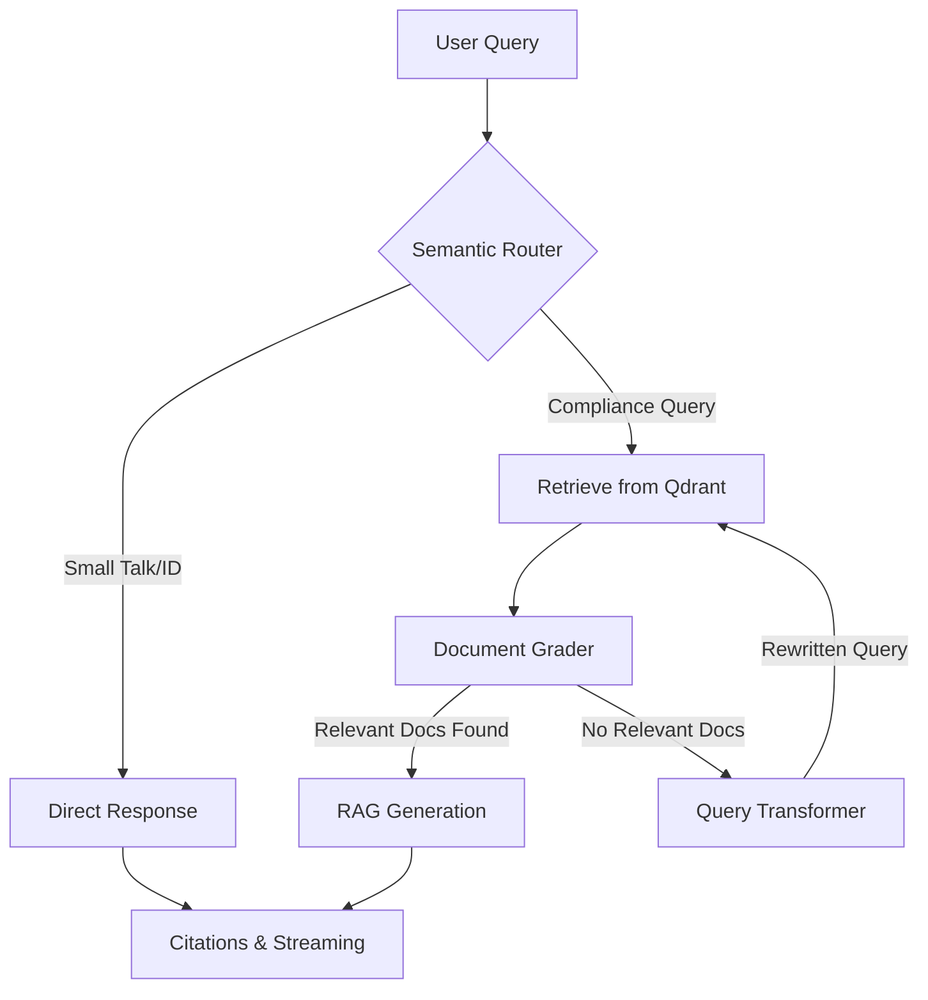

# 🤖 AuditAI: Autonomous Agentic RAG for NIST Compliance

[](https://audit-ai-frontend-pi.vercel.app)

AuditAI is a production-grade **Agentic RAG** system designed to audit internal organizational policies against the **NIST Cybersecurity Framework (CSF 2.0)**. 

Unlike standard RAG pipelines, AuditAI utilizes a **Self-Correcting Graph Architecture** to ensure 100% faithfulness, strictly enforced reasoning, and dynamic retrieval optimization.

---

## 🏗️ Advanced Architecture: The "Agentic" Core

AuditAI is powered by a directed acyclic graph (DAG) orchestrated via **LangGraph**. This allows the system to move beyond "one-shot" retrieval into a multi-step reasoning process.

### 1. The Self-Correction Loop
The system implements a **CRAG (Corrective RAG)** pattern to handle low-quality retrieval:



*   **Semantic Router**: A fast-path LLM classifier that identifies intent. It bypasses the heavy graph for greetings or identity questions, reducing latency and cost.
*   **Document Grader**: Evaluates retrieved chunks for semantic relevance to the query. 
*   **Query Transformer**: If the grader lacks sufficient context, this node re-phrases the user's question into a more optimized search query for vector retrieval, triggering a loop-back.

### 2. Hallucination Control & Citations
AuditAI implements a "Strict Evidence" policy:
*   **Page-Level Citations**: Every claim is mapped back to specific PDF page numbers and document names.
*   **Refusal-Aware Suppression**: If the model determines (based on cross-referencing) that the answer is missing from the database, the backend **dynamically suppresses** citation cards to prevent misleading the user with irrelevant "sources".

---

## 🧠 AI Engineering Stack

| Component | Technology | Rationale |
| :--- | :--- | :--- |
| **Orchestration** | LangGraph | Complex state management and cyclic loops (Self-Correction). |
| **LLM** | Gemini 3 Flash Preview | State-of-the-art reasoning with native long-context support and low latency. |
| **Embeddings** | Gemini `embedding-001` | High semantic density for technical compliance text. |
| **Vector DB** | Qdrant Cloud | High-performance vector search with metadata filtering support. |
| **Performance** | FastAPI (Async) | Supports Server-Sent Events (SSE) for real-time token streaming. |

---

## 📊 Evaluation Results (RAGAS)

| Metric | Score | Status |
| :--- | :--- | :--- |
| **Faithfulness** | `1.0000` | ✅ |
| **Answer Relevancy** | `0.7574` | ✅ |
| **Context Precision** | `0.7838` | ✅ |
| **Context Recall** | `0.9000` | ✅ |

> [!TIP]
> **View the [Full Report](evals/ragas_report.md)** for detailed analysis.

### Key Metrics Defined:
1.  **Faithfulness**: Measures if the answer is derived strictly from the retrieved context.
2.  **Answer Relevancy**: Assesses how well the response addresses the user's intent.
3.  **Context Precision**: Evaluates the signal-to-noise ratio in retrieved chunks.
4.  **Context Recall**: Checks if all necessary information was actually retrieved.

---

## 📂 Simplified Project Structure

We maintain a flat, manageable directory structure for faster development and easier maintenance:

```text
audit-ai-backend/
├── src/audit_ai/
    ├── config.py       # Centralized API & model configuration
    ├── engine.py       # Core LangGraph logic, state & nodes
    ├── ingestion.py    # PDF processing & vector ingestion pipeline
    └── main.py         # FastAPI application & entry point
├── evals/
    ├── collector.py    # Dataset collection from the RAG engine
    ├── evaluator.py    # RAGAS evaluation runner & report generator
    └── test.csv        # NIST compliance test dataset (Ground Truth)
├── data/               # Raw NIST PDF documents
└── Dockerfile          # Multi-stage production build (Python 3.12)
```

---

## 🚀 Getting Started

### Installation
1.  **Install dependencies** using [uv](https://github.com/astral-sh/uv):
    ```bash
    uv sync
    ```
2.  **Setup Environment**:
    ```bash
    cp .env.example .env
    ```

### Execution
*   **Run Backend**: 
    ```bash
    uv run python src/audit_ai/main.py
    ```
*   **Generate Evaluation Report**:
    1. Collect results: `uv run python evals/collector.py`
    2. Run RAGAS: `uv run python evals/evaluator.py`

---

## 🛠️ Deployment

- **Containerization**: Optimized with multi-stage Docker builds using Python 3.12.
- **CI/CD**: Configured for Render/Vercel with automatic health checks.
- **Entry point**: `uvicorn audit_ai.main:app`
