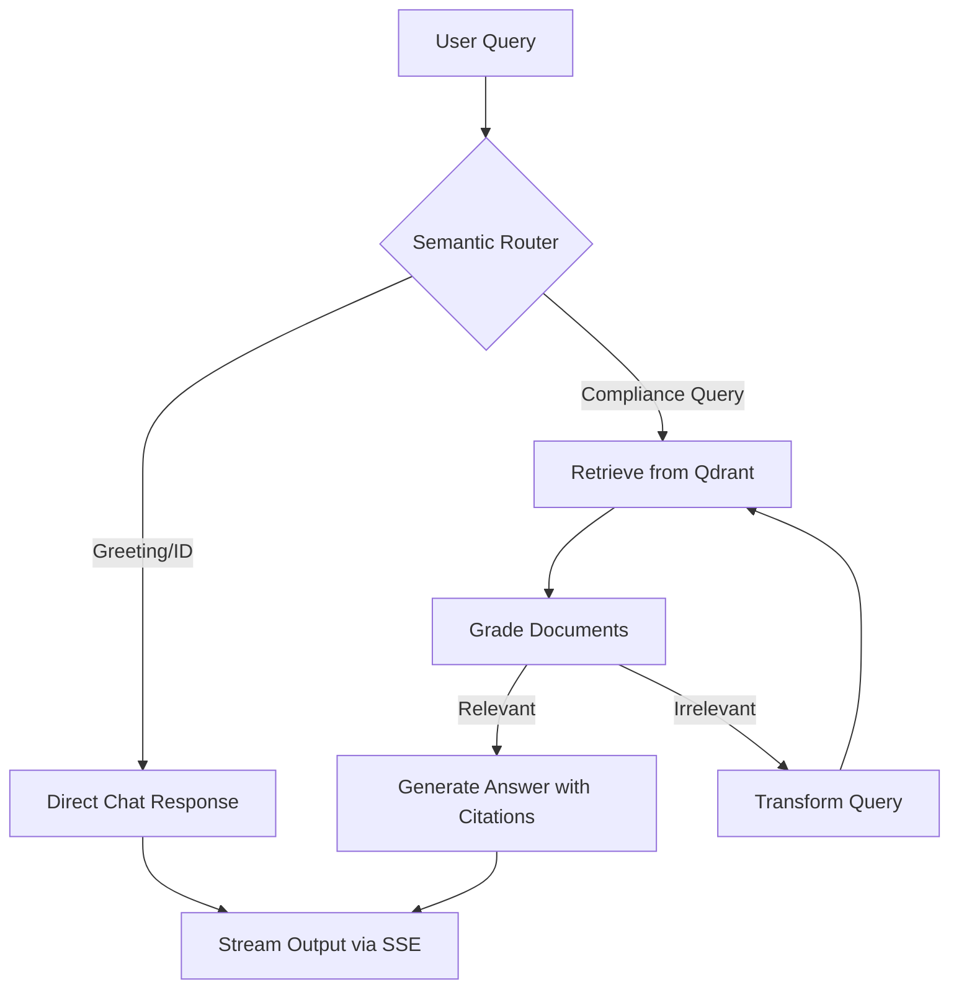

# 🤖 AuditAI Backend

[](https://audit-ai-frontend-pi.vercel.app)

The core intelligence engine for **AuditAI**—an autonomous **Agentic RAG** system designed to audit internal policies against the **NIST Cybersecurity Framework (CSF 2.0)**.

This FastAPI application orchestrates a complex graph workflow using **LangGraph** to route queries, retrieve semantic contexts via **Qdrant**, and generate hallucination-free responses with page-level citations using **Llama-3.3 (via Groq)**.

---

## 🏛️ Architecture

AuditAI uses a directed acyclic graph (DAG) to ensure high-quality retrieval and generation:



## ⚡ Key Capabilities

*   **Agentic Workflow:** Intelligently routes intent and self-corrects retrieval failures via query transformation loops.
*   **Semantic Retrieval:** Uses Google Gemini `text-embedding-004` to index and search NIST PDF document chunks.
*   **Zero Hallucinations:** Strictly enforces page-level citations; dynamically suppresses sources if the model determines the context is insufficient.
*   **Real-time Streaming:** Asynchronous token streaming via Server-Sent Events (SSE) for a snappy UI experience.
*   **Compliance Optimized:** Specifically tuned for the NIST Cybersecurity Framework (CSF 2.0).

## 🛠️ Tech Stack

*   **Language:** Python 3.12+
*   **API:** FastAPI & Uvicorn
*   **Orchestration:** LangGraph & LangChain
*   **LLM:** Llama-3.3 70B (via Groq)
*   **Embeddings:** Google Gemini (text-embedding-004)
*   **Vector DB:** Qdrant Cloud
*   **Package Manager:** [uv](https://github.com/astral-sh/uv)

---

## 🚀 Getting Started

### Prerequisites

- Python 3.12+
- [uv](https://github.com/astral-sh/uv) installed
- API Keys for: Groq, Google AI (Gemini), and Qdrant Cloud

### Local Setup

1.  **Clone the repository:**
    ```bash
    git clone <repository-url>
    cd audit-ai-backend
    ```

2.  **Environment Variables:**
    Copy the example environment file and fill in your keys:
    ```bash
    cp .env.example .env
    ```

3.  **Install Dependencies:**
    ```bash
    uv sync
    ```

4.  **Run the Backend:**
    ```bash
    export PYTHONPATH=$PYTHONPATH:$(pwd)/src
    uv run python src/audit_ai/api/main.py
    ```
    The API will be available at `http://localhost:8000`.

### 📊 Data Ingestion

To populate your Qdrant collection with the NIST framework:

1.  Place your PDF in `data/nist_framework.pdf`.
2.  Run the ingestion script:
    ```bash
    export PYTHONPATH=$PYTHONPATH:$(pwd)/src
    uv run python src/audit_ai/data/ingestion.py
    ```

---

## 🐳 Docker Deployment

### Using Docker Compose
```bash
docker-compose up --build
```

### Manual Docker Build
```bash
docker build -t audit-ai-backend .
docker run -p 8000:8000 --env-file .env audit-ai-backend
```

---

## 🔗 API Documentation

Once running, access the interactive documentation:
- **Swagger UI:** [http://localhost:8000/docs](http://localhost:8000/docs)
- **ReDoc:** [http://localhost:8000/redoc](http://localhost:8000/redoc)

### Key Endpoints
- `POST /chat`: Main streaming endpoint for compliance queries.
- `GET /health`: System health check.

---

## 📈 Evaluation

AuditAI includes a specialized evaluation suite using **Ragas** to measure Faithfulness, Answer Relevance, and Context Precision.

```bash
export PYTHONPATH=$PYTHONPATH:$(pwd)/src
uv run python evals/ragas_eval.py
```
